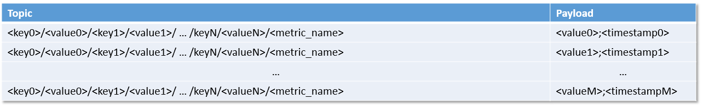
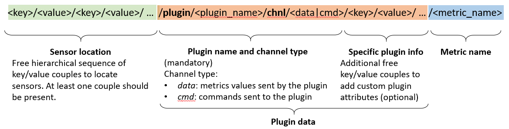
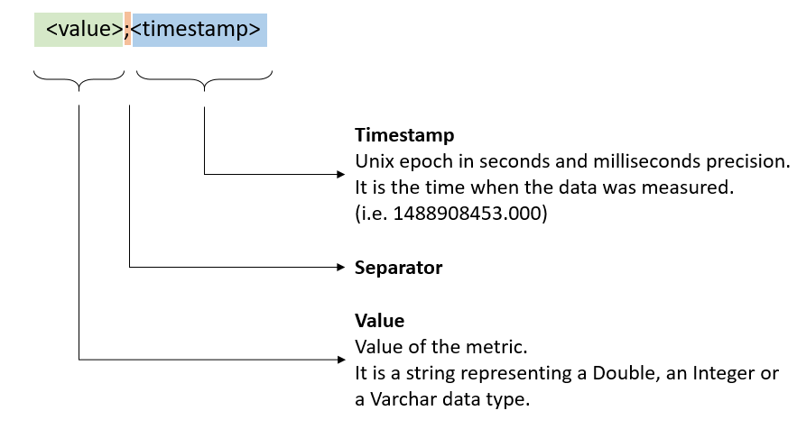
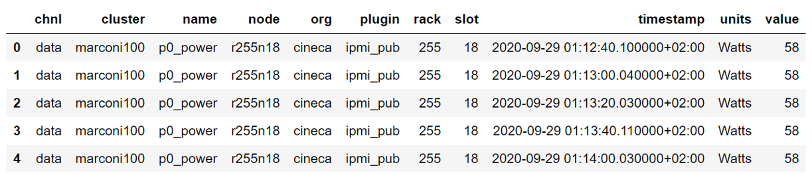
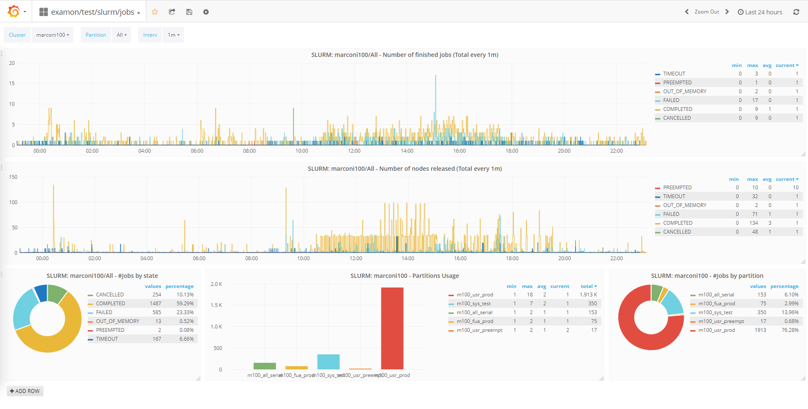

------------------------------------------------------------------------

# Introduction

This is a brief description of the ExaMon platform currently installed at Cineca.

ExaMon (Exascale Monitoring) is a data collection and analysis platform oriented to the management of big data. Its main prerogatives are to manage in a simple way heterogeneous data, both in streaming and batch mode, and to allow the access to these data through a common interface. This simplifies the usability of data supporting applications such as real time anomaly detection, predictive maintenance and efficient resource and energy management using techniques in the domain of machine learning and artificial intelligence. Given its scalable and distributed nature, it is readily applicable to HPC systems, especially exascale sized ones, which is also the primary use case it was designed on.

# ExaMon

In this section we will describe the current implementation of Examon, its data model and data access interface.

## Architecture

The architecture of Examon is composed of different layers, each of them with multiple components. The integration of different data sources is handled by the compositional nature of the infrastructure, where new components can be added seamlessly provided that they respect the correct data formats. The cornerstone of Examon is the middleware layer provided by MQTT^([\[1\]](#ftnt1)) brokers, which are the receivers of the data generated by the low-level plugins. On top of the MQTT brokers there is the data storage layer, where the data is uniformly formatted. From the storage layer the data can be fed to the high-level applications layer, by exploiting a client that exposes the underlying data collected and stored within Examon.


###  Sensor Collectors

These are the low-level components having the task of reading the data from the several sensors scattered across the system and delivering them, in a standardized format, to the upper layer of the stack. These software components are composed of two main objects, the MQTT API and the Sensor API object. The former implements the MQTT protocol functions and it is the same among all the collectors while the latter implements the custom sensor functions related to the data sampling and is unique for each kind of collector. Considering the specific sensor API object, we can distinguish collectors that have direct access to hardware resources like IPMI, PMU units in a CPU, and collectors that sample data from other applications (i.e Ganglia and Nagios) and batch schedulers (i.e. Slurm).

###  Communication layer

The framework is built around the MQTT protocol. MQTT implements the “publish-subscribe” messaging pattern and requires three different agents to work: (i) The “publisher”, having the role of sending data on a specific “topic”. (ii) The “subscriber”, that needs certain data so it subscribes to the appropriate topic. (iii) The “broker”, that has the functions of (a) receiving data from publishers, (b) making topics available to subscribers, (c) delivering data to subscribers. The basic MQTT communication mechanism is as follows. When a publisher agent sends some data having a certain topic as a protocol parameter, the topic is created and available at the broker. Any subscriber to that topic will receive the associated data as soon as it is available to the broker. In this scenario, collector agents have the role of “publishers”.

### Storage layer

ExaMon provides a mechanism to store metrics mainly for visualization and analysis of historical data. We use a distributed and scalable time series database (KairosDB) that is built on top of a NoSQL database (Apache Cassandra) as a back-end. Examon implements a specific MQTT subscriber (MQTT2Kairos) to provide a bridge between the MQTT protocol and the KairosDB data insertion mechanism. The bridge leverages the particular MQTT topics structure of the monitoring framework to automatically form the KairosDB insertion statement. This gives multiple advantages: first, it lowers the computational overhead of the bridge since it is reduced to a string parsing operation per message; secondly, makes it easy to form the database query starting only from the knowledge of the matching MQTT topic; lastly, it decouples the transport layer from the storage layer making it easy to migrate to new data storage systems.

###  Applications Layer 

The data gathered by the monitoring framework can serve multiple purposes, as presented in the application layer. Data can be visualized using web-based tools or, for example, machine learning techniques can be applied to build predictive models or online fault detection algorithms. The ExaMon framework provides a convenient software component (examon-client) which implements a consistent and unique interface between the heterogeneous storage layer and the applications.

## Data model

ExaMon adopts a non-relational, hierarchical data model, which is essential for dealing with a huge amount and variety of data.

At the heart of the data model is the concept of metric. The metric is essentially the physical entity (such as a sensor) or abstract entity (such as a log line generated by a running application) that generates a value (data). The value can be a number or a string or a whole line of text and is associated with a timestamp, i.e. the instant in time when the value was collected. Finally, each metric can have one or more tags, in the form of key-value pairs, that describe in detail the properties of the metric.

In ExaMon, the tags are used to define extra information about the sensor and some special mandatory properties of the protocol.


The data model resembles a hierarchical tree. In the Figure are shown the relevant sections.

-   Sensor location: (Mandatory) it is a free hierarchical sequence of key/value couples used to locate the data source. At least one couple should be present.
-   Plugin name: (Mandatory) it is the name of the data collector agent (plugin) which acquires data from this sensor
-   Channel type: (Mandatory) specifies the type of channel
      -   data: metrics values sent by the plugin
      -   cmd: commands sent to the sensor/plugin
-   Specific plugin tags: (Optional) additional free key/values couples to add custom plugin attributes that are unique for this data source.

The data source or a sensor is effectively defined when it is possible to uniquely determine a complete path within the tag hierarchical tree, from top to bottom. This means that in ExaMon, a sensor can only have one value for each of its tags.

Currently, to enter data within ExaMon you must connect to the transport layer (MQTT Broker) and send messages in a specific format.

### Transport

This data model fits well with the [MQTT protocol](https://www.google.com/url?q=https://mosquitto.org/man/mqtt-7.html&sa=D&source=editors&ust=1682361844065309&usg=AOvVaw2anzH1JA3T0GiuHX4GGZ_n) of the transport layer.  

Indeed, the tags and metric name define the topic, while the value and timestamp are part of the payload.



#### MQTT Topic

The following figure shows in detail the structure of an MQTT topic implementing the ExaMon data model.



#### MQTT Payload

The MQTT payload, in the basic implementation of ExaMon, is a string obtained by concatenating the measured value and the timestamp associated with it.



#### Example

An example of the MQTT data that are compatible with the ExaMon data model are the following (Obtained from the reference implementation in [pmu_pub](https://www.google.com/url?q=https://github.com/EEESlab/examon/tree/master&sa=D&source=editors&ust=1682361844067080&usg=AOvVaw0EelZLONoGKHveGk3PgZk0)):

|                                                                                         |
|-----------------------------------------------------------------------------------------|
| Topic:                                                                                  |
| org/testorg/cluster/testcluster/node/testnode00/plugin/pmu_pub/chnl/data/core/23/aperf  |
| Payload:                                                                                |
| 10822010350093;1658832078.001                                                           |

### Storage

In the storage layer the ExaMon data model is mapped to the Cassandra table schema. A table in Cassandra is a collection of rows.  Each row is identified by a primary key. KairosDB defines primary keys in Cassandra primarily as a concatenation of the metric_name and tags and are used to index and search data. The values and timestamps on the other hand represent the columns of the row.


## Query language

The data stored by ExaMon can be retrieved by direct queries to the Cassandra and KairosDB modules. However, data in Cassandra is stored in de-normalized form. While this simplifies the scalability of the system and increases its performance, it also adds complexity to data management from an application perspective.  

In order to simplify the development of applications based on ExaMon data, a uniform entry point for all the data was developed and named examon-client. It will be described in the following section.

### Examon-client

This client makes it possible to query metrics from the ExaMon database. It is based on a pluggable interface and, in the current implementation, the KairosDB REST API is implemented. Examon-client is a python package that enables uniform access and analytics on ExaMon data; it offers a SQL-like query language for ease of use. ExaMon data can be accessed locally using the Pandas^([\[2\]](#ftnt2)) interface or in a distributed fashion (for heavy workloads) using Apache Spark^([\[3\]](#ftnt3)) or Dask^([\[4\]](#ftnt4)).


Queries can be built and executed with an SQL-like language.

```python
data = sq.SELECT('*') \
      .FROM('p0_power') \
      .WHERE(cluster='marconi100' node='r255n18') \
      .TSTART(10,'minutes') \
      .execute()
```

The data returned by the query is a dataframe.



## Data Visualization

Another way to access the data is by exploiting the visualization tool integrated in ExaMon as a high-level component, precisely Grafana^([\[5\]](#ftnt5)). With Grafana live visualization of different data sources can be obtained, ranging from information about completed jobs, system services status and HW-sensors’ measurements. A wide set of views and dashboard have been already prepared and can be accessed by using the IP address and port of the server hosting the service.

For instance, selecting some nodes and a time interval (e.g. the last 5 minutes), the different metrics can be visualised as time-series and/or aggregated values (average, max/min, variance, etc).


Alternatively, Grafana can be used to gain an overall view of all the racks of the data centers, with many potential benefits, among them identifying nodes with anomalous thermal load or workload imbalance.


Finally, it is possible to visualize the usage of the computing resources made by the users through the metrics acquired from the job scheduler (Slurm).




|      |     |             |
|------|-----|-------------|
| v0.3 |     | Aug 1, 2022 |

------------------------------------------------------------------------

[\[1\]](#ftnt_ref1) https://www.oasis-open.org/committees/mqtt/

[\[2\]](#ftnt_ref2) https://pandas.pydata.org/

[\[3\]](#ftnt_ref3) https://spark.apache.org/

[\[4\]](#ftnt_ref4) https://dask.org/

[\[5\]](#ftnt_ref5) https://grafana.com/

[\[6\]](#ftnt_ref6) http://ganglia.sourceforge.net/

[\[7\]](#ftnt_ref7) https://www.nagios.org/

[\[8\]](#ftnt_ref8)https://prace-ri.eu/wp-content/uploads/Design_Development_and_Improvement_of_Nagios_System_Monitoring_for_Large_Clusters.pdf
