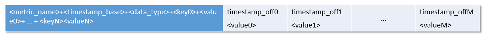
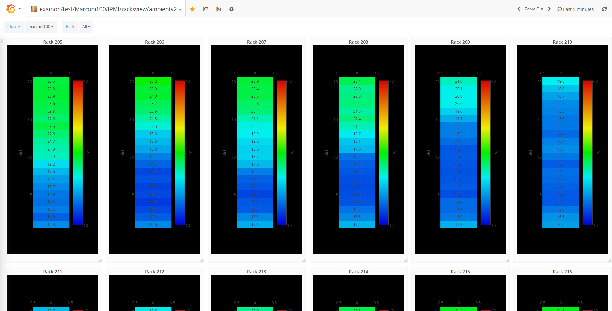

# Examon


------------------------------------------------------------------------

## Introduction

ExaMon (Exascale Monitoring) is a powerful data collection and analytics platform designed for managing big data. Its main focus is on simplifying the management of heterogeneous data, both in real-time streaming and batch modes, while enabling access to this data through a single interface. With its advanced capabilities in machine learning and artificial intelligence, ExaMon supports real-time anomaly detection, predictive maintenance, and efficient resource and energy management. It's highly scalable and distributed architecture makes it an ideal solution for HPC systems, especially those at exascale levels, which is its primary use case.

## Architecture

ExaMon's architecture consists of multiple layers, each with its own set of components. The infrastructure's compositional nature allows for seamless integration of various data sources, provided they adhere to the correct data formats. At the core of ExaMon lies the middleware layer, powered by MQTT (Message Queuing Telemetry Transport) brokers, which act as the receivers of data generated by low-level plugins. The data is then uniformly formatted and stored in the data storage layer. Finally, a client interface is used to access the underlying data collected and stored within ExaMon, allowing high-level applications to easily access and utilize this information.


###  Sensor Collectors

The collector layer comprises low-level components responsible for reading data from various sensors scattered throughout the system and delivering it in a standardized format to the upper layers of the stack. These software components consist of two main objects: the MQTT API and the Sensor API object. The MQTT API implements the MQTT protocol functions, which are consistent across all collectors. The Sensor API object, on the other hand, implements custom sensor functions related to data sampling and is unique to each collector. The specific sensor API object can be classified as either having direct access to hardware resources (such as IPMI or PMU units in a CPU) or sampling data from other monitoring applications (such as Ganglia and Nagios) and batch schedulers (such as Slurm).

###  Communication layer

The ExaMon framework utilizes the MQTT protocol, which implements the "publish-subscribe" messaging pattern and requires three agents to function: the publisher, subscriber, and broker. The publisher sends data on a specific topic, while the subscriber subscribes to the appropriate topic to receive the required data. The broker has the responsibility of receiving data from publishers, making topics available to subscribers, and delivering data to subscribers. In the MQTT communication mechanism, when a publisher sends data with a specific topic as a protocol parameter, the topic is created and made available at the broker. Any subscriber to that topic will receive the associated data as soon as it becomes available to the broker. In this context, collector agents act as publishers by sending data to the broker.

### Storage layer

ExaMon provides a mechanism to store metrics for visualization and analysis of historical data using a distributed and scalable time series database called KairosDB, built on top of the NoSQL database Apache Cassandra. To enable the insertion of data into KairosDB, ExaMon implements a specific MQTT subscriber called MQTT2Kairos, which acts as a bridge between the MQTT protocol and the KairosDB insertion mechanism. This bridge takes advantage of the MQTT topics structure of the monitoring framework to automatically form the KairosDB insertion statement, resulting in several advantages. First, it reduces the computational overhead of the bridge to a string parsing operation per message. Second, it simplifies the formation of database queries, starting only from the knowledge of the matching MQTT topic. Lastly, it decouples the transport layer from the storage layer, making it easy to migrate to new data storage systems.

###  Applications Layer 

The application layer of the ExaMon framework enables users to extract insights and intelligence from the data collected by the monitoring system. The collected data can be visualized using web-based tools or used for machine learning applications such as predictive modeling and online fault detection. The ExaMon framework provides a convenient software component called the examon-client, which serves as a consistent and unified interface between the heterogeneous storage layer and the applications. With this component, users can easily access the data collected by the system and use it for their specific applications without needing to worry about the underlying data formats or storage mechanisms. The examon-client also provides various APIs and libraries to facilitate the development of new applications that use the data collected by ExaMon.

## Data model

ExaMon's data model is designed to handle large and diverse data sets, and it adopts a non-relational, hierarchical data model to achieve this. At the core of this model is the concept of a "metric", which represents the physical or abstract entity generating data. A metric generates a value, which could be a number, a string, or a line of text, and is associated with a timestamp indicating the time of collection. Additionally, each metric can have one or more tags in the form of key-value pairs, which provide detailed information about the metric's properties. This hierarchical structure allows for efficient storage and retrieval of data, as well as flexible querying and analysis.

In ExaMon, the tags are used to define extra information about the sensor and some special mandatory properties of the protocol.


The data model resembles a hierarchical tree. In the Figure are shown the relevant sections.

-   Sensor location: (Mandatory) it is a free hierarchical sequence of key/value couples used to locate the data source. At least one couple should be present.
-   Plugin name: (Mandatory) it is the name of the data collector agent (plugin) which acquires data from this sensor
-   Channel type: (Mandatory) specifies the type of channel
      -   data: metrics values sent by the plugin
      -   cmd: commands sent to the sensor/plugin
-   Specific plugin tags: (Optional) additional free key/values couples to add custom plugin attributes that are unique for this data source.

The data source or a sensor is effectively defined when it is possible to uniquely determine a complete path within the tag hierarchical tree, from top to bottom. This means that in ExaMon, a sensor can only have one value for each of its tags.

Currently, to enter data within ExaMon you must connect to the transport layer (MQTT Broker) and send messages in a specific format.

## Transport

The ExaMon data model is well-suited for use with the MQTT protocol in the transport layer.

In MQTT, the tags and metric name define the topic, while the value and timestamp are part of the payload. This mapping fits well with the ExaMon data model, where each metric is associated with specific tags that define its context.

By leveraging the MQTT protocol, ExaMon can efficiently transport data across distributed systems, allowing for real-time monitoring and analysis of system performance. MQTT provides a lightweight and efficient communication protocol that is well-suited for IoT and other resource-constrained systems.


### MQTT Topic

The following figure shows in detail the structure of an MQTT topic implementing the ExaMon data model.


### MQTT Payload

The MQTT payload, in the basic implementation of ExaMon, is a string obtained by concatenating the measured value and the timestamp associated with it.


### Example

An example of the MQTT data that are compatible with the ExaMon data model are the following (Obtained from the reference implementation in [pmu_pub](https://www.google.com/url?q=https://github.com/EEESlab/examon/tree/master&sa=D&source=editors&ust=1682361844067080&usg=AOvVaw0EelZLONoGKHveGk3PgZk0)):

|                                                                                         |
|-----------------------------------------------------------------------------------------|
| Topic:                                                                                  |
| org/testorg/cluster/testcluster/node/testnode00/plugin/pmu_pub/chnl/data/core/23/aperf  |
| Payload:                                                                                |
| 10822010350093;1658832078.001                                                           |

## Storage

In ExaMon's storage layer, the data model is mapped to the Cassandra table schema. A table in Cassandra is essentially a collection of rows, where each row is identified by a primary key. ExaMon leverages KairosDB to define primary keys in Cassandra and to enable efficient indexing and searching of data. Primary keys are defined as a concatenation of the metric name and tags, and they are used to index and search data efficiently. The values and timestamps, on the other hand, represent the columns of the row. 



## Query language

The data stored by ExaMon can be retrieved by querying the Cassandra and KairosDB modules directly. However, since the data is stored in a de-normalized form in Cassandra, managing the data from an application perspective can be complex, despite the benefits of improved scalability and performance.

To simplify the development of applications that use ExaMon data, a uniform entry point for all data was developed and named Examon-client. This uniform interface provides a simplified and consistent view of the data, hiding the complexities of data management from the application developer.

Examon-client allows users to access ExaMon's monitoring and analytics data using a common set of queries and provides a simpler and more intuitive way to interact with the data. In the following section, we will describe the features and capabilities of Examon-client in more detail.

### Examon-client

Examon-client is a python package that provides a uniform interface for accessing and analyzing data stored in the ExaMon database. This client enables querying of metrics from the database through a pluggable interface. In the current implementation, the client uses the KairosDB REST API to retrieve data.

Examon-client provides a SQL-like query language for ease of use, allowing users to retrieve data in a simple and intuitive way. The client is designed to work seamlessly with ExaMon's storage architecture, which is based on Cassandra and KairosDB.

With Examon-client, ExaMon data can be accessed locally using the Pandas interface or in a distributed fashion using Apache Spark or Dask. This makes it possible to handle heavy workloads efficiently and effectively.


Queries can be built and executed with an SQL-like language.

```python
data = sq.SELECT('*') \
      .FROM('p0_power') \
      .WHERE(cluster='marconi100' node='r255n18') \
      .TSTART(10,'minutes') \
      .execute()
```

The data returned by the query is a dataframe.


## Data Visualization

In addition to querying data through Examon-client, users can also access ExaMon data through the integrated visualization tool, Grafana. Grafana is a high-level component that provides live visualization of different data sources, including information about completed jobs, system service statuses, and hardware sensors' measurements.

A wide range of views and pre-built dashboards can be accessed using the dedicated Grafana server. For example, by selecting specific nodes and a time interval (such as the last 5 minutes), users can visualize different metrics as time-series and/or aggregated values (average, max/min, variance, etc.).


Alternatively, Grafana can be also used to gain an overall view of all the racks of the data centers, with many potential benefits, among them identifying nodes with anomalous thermal load or workload imbalance.



Finally, it is possible to visualize the usage of the computing resources made by the users through the metrics acquired from the job scheduler (Slurm).


Grafana provides an intuitive and user-friendly interface for exploring and visualizing ExaMon data, enabling users to quickly and easily gain insights into system performance and behavior. With its extensive range of features and customization options, Grafana is a powerful tool for analyzing and visualizing ExaMon data.


------------------------------------------------------------------------
