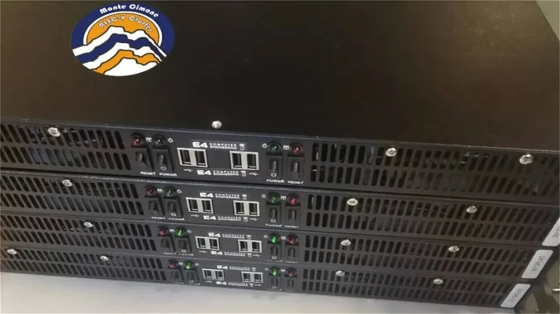

## MonteCimone - UniBO

<figure markdown>
  { width="300" }
</figure>

Configuration of the Monte Cimone cluster:

- Cluster: Monte Cimone
- Manufacturer: E4
- Form factor: 1U
- Blade configuration: Four blades with dual boards
- Motherboard: HiFive Unmatched developer by SiFive
- SoC: Freedom U740
- Cores: Four U74 cores at 1.4GHz and one S7 core with Mix+Match technology
- Cache: 2MB L2 cache
- Memory: 16GB DDR4-1866
- Storage: 1TB NVMe SSD
